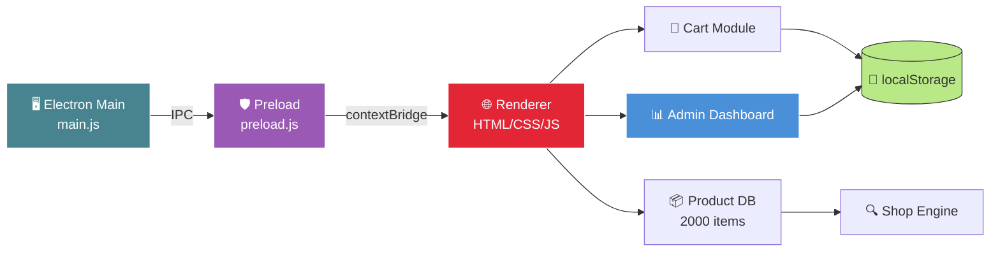
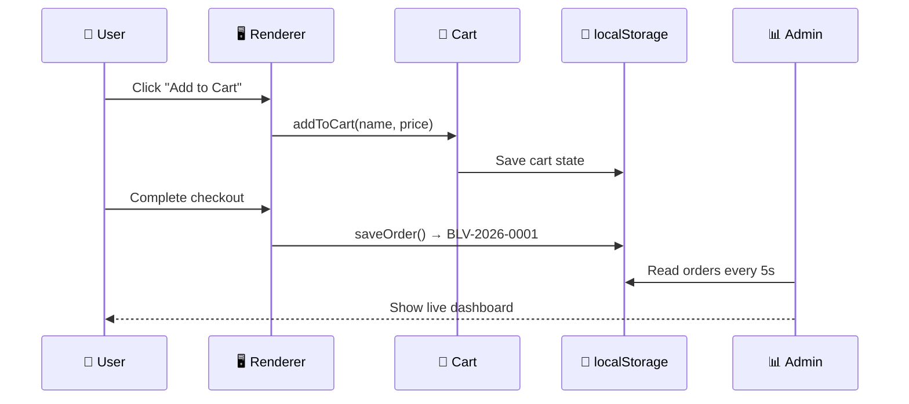

<!-- ═══════════════════════════════════════════════════════════════ -->
<!-- 🫘 Bloopville — Character Brand E-Commerce Desktop App         -->
<!-- ═══════════════════════════════════════════════════════════════ -->

<div align="center">


</div>

<div align="center">


</div>

<br/>

<div align="center">
  <a href="https://sumit966.github.io/bloopville-prototype/">
    
  </a>
  
  
</div>

<br/>

<div align="center">
  <a href="https://github.com/sumit966/bloopville-prototype/stargazers">
    
  </a>
  <a href="https://github.com/sumit966/bloopville-prototype/network/members">
    
  </a>
  <a href="https://github.com/sumit966/bloopville-prototype/issues">
    
  </a>
  <a href="https://github.com/sumit966/bloopville-prototype/commits/main">
    
  </a>
</div>

<br/>

<div align="center">
  
  
  
  
  
</div>

<br/>

<div align="center">
  
  
  
  
</div>

<br/>

<div align="center">
  <i>🫘 A fictional brand brought to life · Built for portfolio & learning</i>
</div>

<br/>


---

## 📑 Table of Contents

<div align="center">

| 🎯 | 🏗️ | 🛠️ |
|:---:|:---:|:---:|
| [What Is This](#-what-is-this) | [Why I Built This](#-why-i-built-this) | [Tech Stack](#️-tech-stack) |
| [Features](#-features) | [Architecture](#️-architecture) | [Data Flow](#-data-flow) |
| [Project Structure](#-project-structure) | [Installation](#-installation) | [Configuration](#️-configuration) |
| [Usage](#-usage) | [Admin Dashboard](#-admin-dashboard) | [Results](#-results) |
| [Roadmap](#️-roadmap) | [What I Learned](#-what-i-learned) | [About Me](#-about-me) |

</div>

---

## 🫘 What Is This

<div align="center">
  
</div>

<br/>

**Bloopville** is a fictional character-brand store brought to life as a **native desktop application**. It is not a tutorial clone, not a to-do app, and not a weather widget — it is a **complete, working prototype of a modern e-commerce platform**, built entirely from scratch with vanilla web technologies and wrapped in an Electron desktop shell.

It has a real product catalog, a real cart, a real checkout flow, real order management, and a real admin dashboard. It has its own brand identity, its own mascot, and its own design system.

<div align="center">

| 📦 | 🛒 | 📊 | 🎨 |
|:---:|:---:|:---:|:---:|
| **2,000+** Products | **Full** Cart System | **Live** Admin Dashboard | **Custom** Design System |

</div>

---

## ❓ Why I Built This

<div align="center">
  
</div>

<br/>

Most beginner portfolios show the same handful of projects — a calculator, a to-do list, a weather widget. I wanted to build something that proved I could think **at the level of a real product.**

I wanted to prove to myself that I could:

- 🏗️ **Architect a multi-page application** without any framework, build tool, or CMS
- 📦 **Handle data at scale** — 2,000 products with live search, category filters, sort options, and pagination that all work in milliseconds
- 🛒 **Build a complete commerce flow** — from browsing products, to adding to cart, to checkout, to saving real orders, to tracking them
- 📊 **Create a working admin dashboard** with live statistics, revenue charts, top-selling products, and order status management
- 🎨 **Design a cohesive brand identity** — its own mascot, its own jelly bean color palette, its own personality
- 💻 **Package it as a desktop app** using Electron, so it runs as a real installable application — not just another webpage

**The goal was never to make it pretty. The goal was to make it real.**

---

## ✨ Features

### 🛍️ Shopping Experience

<table align="center">
<tr>
<td width="50%" valign="top">

- 🏬 **2,000 Products** across 8 categories
- 🔍 **Live Search** — instant, multi-field
- 🏷️ **Category Filters** — Plush, Electronics, Clothing, Accessories, Home, Stationery, Collectibles, Bags
- ↕️ **Sort Options** — Popularity, Price ↑↓, Rating, Name
- 📄 **Pagination** — 24 / 48 / 96 per page

</td>
<td width="50%" valign="top">

- ❤️ **Wishlist** — saved across sessions
- ⭐ **Ratings & Reviews** — every product
- 🎯 **Dynamic Product Pages** — loaded from a data module
- 🎁 **Discount Badges** — auto-generated sale prices
- 🖼️ **Same Mascot** — brand consistency across all products

</td>
</tr>
</table>

### 🛒 Cart & Checkout

<table align="center">
<tr>
<td width="50%" valign="top">

- 🛍️ **Sliding Cart Sidebar** — opens from any page
- ➕ **Add / Remove Items** — quantity per product
- 💰 **Live Total** — auto-calculated

</td>
<td width="50%" valign="top">

- 💳 **Full Checkout Flow** — shipping form + payment fields
- 🆔 **Order IDs** — `BLV-2026-0001` format
- 🗺️ **Order Tracking** — timeline by order ID

</td>
</tr>
</table>

### 📊 Admin Dashboard

<table align="center">
<tr>
<td width="50%" valign="top">

- 🔐 **Password Protected** — SHA-256 auth gate
- 📈 **Live Stats** — orders, revenue, AOV, pending
- 📅 **Today vs All Time** — split metrics
- 📊 **7-Day Revenue Chart** — animated bar chart

</td>
<td width="50%" valign="top">

- 🏆 **Top Products** — ranked with medals 🥇🥈🥉
- 📋 **Orders Table** — customers, items, totals, dates
- 🔄 **Status Updates** — Pending → Shipped → Delivered
- ⏱️ **Auto-Refresh** — every 5 seconds

</td>
</tr>
</table>

### 🎨 Design & UX

<table align="center">
<tr>
<td width="50%" valign="top">

- 🫘 **Jelly Bean Palette** — Cherry, Orange, Lemon, Lime, Blueberry, Grape
- 🌙 **Dark Mode** — remembered across sessions
- 📱 **Fully Responsive** — mobile, tablet, desktop
- 🎬 **Scroll Reveal** — sections fade in as you scroll

</td>
<td width="50%" valign="top">

- ✨ **Glossy Jelly Buttons** — 3D depth + hover lift
- 🫧 **Floating Bubbles** — animated hero
- 🌊 **Wave Dividers** — smooth transitions
- 🍬 **Candy Stripes** — animated accents

</td>
</tr>
</table>

### 🤖 Extra Magic

<table align="center">
<tr>
<td width="50%" valign="top">

- 💬 **Live Chat Widget** — floating bot assistant
- 🎁 **Spin-to-Win** — discount wheel popup
- ⏰ **Flash Sale Timer** — live countdown
- 📸 **Instagram Feed** — mock social grid

</td>
<td width="50%" valign="top">

- 🌍 **Multi-Language** — EN, ES, FR, HI
- 🤖 **AI Character Generator** — Stable Horde API
- 📱 **PWA Installable** — add to home screen
- 📊 **Service Worker** — offline support

</td>
</tr>
</table>

### 💻 Desktop App

<table align="center">
<tr>
<td width="50%" valign="top">

- 🖥️ **Native Window** — real app, not browser tab
- 📋 **Native Menu Bar** — Bloopville · View · Navigate · Help
- ⌨️ **Keyboard Shortcuts** — `Ctrl+H`, `Ctrl+S`

</td>
<td width="50%" valign="top">

- 🔗 **External Link Handling** — opens in default browser
- 📦 **Installable** — build `.exe`, `.dmg`, `.AppImage`
- 💾 **Fully Offline** — no internet needed

</td>
</tr>
</table>

---

## 🏗️ Architecture

<div align="center">



</div>

### 📐 ASCII Fallback

```
┌─────────────────────────────────────────────────────────────┐
│                     BLOOPVILLE DESKTOP APP                  │
├─────────────────────────────────────────────────────────────┤
│                                                             │
│  ┌──────────────────┐         ┌──────────────────────────┐  │
│  │  MAIN PROCESS    │◄───────►│  RENDERER PROCESS        │  │
│  │  (main.js)       │   IPC   │  (HTML/CSS/JS pages)     │  │
│  │                  │         │                          │  │
│  │  • Window mgmt   │         │  • UI rendering          │  │
│  │  • Native menu   │         │  • Cart logic            │  │
│  │  • File access   │         │  • Product database      │  │
│  │  • OS dialogs    │         │  • Admin dashboard       │  │
│  └──────────────────┘         └──────────────────────────┘  │
│           ▲                              ▲                  │
│           │                              │                  │
│           ▼                              ▼                  │
│  ┌──────────────────────────────────────────────────────┐   │
│  │              preload.js (Secure Bridge)              │   │
│  │    contextBridge · contextIsolation · nodeIntegration│  │
│  └──────────────────────────────────────────────────────┘   │
│                                                             │
└─────────────────────────────────────────────────────────────┘
```

### 🧩 System Components

<table align="center">
<tr>
<td><b>Component</b></td>
<td><b>Purpose</b></td>
</tr>
<tr>
<td>🖥️ <b>main.js</b></td>
<td>Electron entry point — creates window, native menu, handles OS interactions</td>
</tr>
<tr>
<td>🛡️ <b>preload.js</b></td>
<td>Secure bridge between main and renderer — exposes only safe APIs</td>
</tr>
<tr>
<td>🌐 <b>index.html + pages/</b></td>
<td>All UI screens — home, shop, cart, checkout, admin, tracking</td>
</tr>
<tr>
<td>🎨 <b>style.css</b></td>
<td>Full design system — variables, components, dark mode, animations</td>
</tr>
<tr>
<td>⚙️ <b>main.js (renderer)</b></td>
<td>Core logic — cart, theme, chat, PWA, scroll reveal</td>
</tr>
<tr>
<td>🔍 <b>shop.js</b></td>
<td>Search, filter, sort, pagination engine</td>
</tr>
<tr>
<td>📦 <b>products-data.js</b></td>
<td>2,000-product catalog as a structured dataset</td>
</tr>
<tr>
<td>📊 <b>orders.js</b></td>
<td>Order manager — save, retrieve, update status</td>
</tr>
<tr>
<td>💾 <b>localStorage</b></td>
<td>Persistent state — cart, theme, orders, wishlist</td>
</tr>
</table>

---

## 🔄 Data Flow

<div align="center">



</div>

### 📊 Data Flow Table

<table align="center">
<tr>
<td align="center" width="20%">

**1️⃣ Browse**


</td>
<td align="center" width="20%">

**2️⃣ Add**


</td>
<td align="center" width="20%">

**3️⃣ Checkout**


</td>
<td align="center" width="20%">

**4️⃣ Save**


</td>
<td align="center" width="20%">

**5️⃣ Track**


</td>
</tr>
</table>

---

## 🛠️ Tech Stack

<div align="center">

### Frontend


### Desktop


### Tooling


</div>

<br/>

<table align="center">
<tr>
<td><b>Layer</b></td>
<td><b>Technology</b></td>
<td><b>Why</b></td>
</tr>
<tr>
<td>🖥️ Desktop Shell</td>
<td>Electron 31</td>
<td>Cross-platform native app</td>
</tr>
<tr>
<td>🎨 Rendering</td>
<td>HTML5 + CSS3</td>
<td>Semantic markup, custom design system</td>
</tr>
<tr>
<td>⚙️ Logic</td>
<td>Vanilla JavaScript (ES6+)</td>
<td>No framework — pure web platform</td>
</tr>
<tr>
<td>📦 Data</td>
<td>Local JS module</td>
<td>2,000 products as a structured dataset</td>
</tr>
<tr>
<td>💾 State</td>
<td>localStorage</td>
<td>Cart, theme, orders, wishlist</td>
</tr>
<tr>
<td>📤 Build</td>
<td>electron-builder</td>
<td>Cross-platform installers</td>
</tr>
<tr>
<td>🌐 Hosting</td>
<td>GitHub Pages</td>
<td>Live demo for the web version</td>
</tr>
</table>

> 💡 **No frameworks. No build tools. No backend. Just the web platform, pushed to its limits.**

---

## 📁 Project Structure

```
bloopville-prototype/
│
├── 📄 main.js                    # Electron main process
├── 📄 preload.js                 # Secure IPC bridge
├── 📄 package.json               # Dependencies + scripts
├── 📄 index.html                 # Homepage
├── 📄 manifest.json              # PWA config
├── 📄 service-worker.js          # Offline support
├── 📄 README.md                  # You are here
├── 📄 LICENSE                    # MIT
├── 📄 .gitignore
│
├── 📁 pages/
│   ├── characters.html           # Character showcase
│   ├── products.html             # Full catalog + pagination
│   ├── product.html              # Dynamic product detail
│   ├── checkout.html             # Checkout flow
│   ├── track.html                # Order tracking
│   ├── admin-login.html          # Auth gate
│   ├── admin.html                # Live dashboard
│   ├── ai-generator.html         # AI character tool
│   ├── about.html                # Brand story
│   └── contact.html              # Contact form
│
└── 📁 assets/
    ├── 📁 css/
    │   └── style.css             # Full design system
    ├── 📁 js/
    │   ├── main.js               # Core logic (cart, theme, chat)
    │   ├── shop.js               # Search/filter/pagination engine
    │   ├── product.js            # Product detail loader
    │   ├── orders.js             # Order manager
    │   └── products-data.js      # 2,000-product catalog
    └── 📁 images/
        ├── mascot.svg            # Bloopville mascot
        └── 📁 screenshots/       # README screenshots
```

---

## 🚀 Installation

<div align="center">
  
  
  
</div>

<br/>

### 🌐 Option 1 — Live Website (Fastest)

Just open this link:

👉 **https://sumit966.github.io/bloopville-prototype/**

No install. Works in any modern browser.

### 💻 Option 2 — Desktop App

**Prerequisites:** [Node.js](https://nodejs.org) v18 or higher

```bash
# 1. Clone the repository
git clone https://github.com/sumit966/bloopville-prototype.git

# 2. Enter the folder
cd bloopville-prototype

# 3. Install dependencies (first time only — ~2 minutes)
npm install

# 4. Launch the app
npm start
```

Bloopville opens as a native desktop window. 🎉

### 📦 Option 3 — Build Your Own Installer

```bash
# Windows installer (.exe)
npm run build:win

# macOS installer (.dmg)
npm run build:mac

# Linux installer (.AppImage)
npm run build:linux
```

Installers appear in the `dist/` folder.

---

## ⚙️ Configuration

### 🎨 Theme Colors (`assets/css/style.css`)

```css
:root {
    --cherry: #E32636;
    --orange: #FF8C00;
    --lemon: #FFE066;
    --lime: #B8E986;
    --blueberry: #4A90D9;
    --grape: #9B59B6;
    --cottoncandy: #FFB6C1;
    --licorice: #2D2D3A;
}
```

### 🔐 Admin Password (`pages/admin-login.html`)

Default: **`bloopville2026`**

To change it:
1. Generate a SHA-256 hash at [emn178.github.io/online-tools/sha256.html](https://emn178.github.io/online-tools/sha256.html)
2. Replace `ADMIN_HASH` in `pages/admin-login.html`

### 📊 Google Analytics (`assets/js/main.js`)

```javascript
const GA_MEASUREMENT_ID = 'G-XXXXXXXXXX';
// Replace with your Measurement ID from analytics.google.com
```

---

## 🎮 Usage

### 👤 As a Customer

```
1. Open the app (or the live URL)
2. Browse products on the Shop page
3. Use search, category filters, sort, and pagination
4. Click any product to view its detail page
5. Add items to your cart (heart icon saves to wishlist)
6. Click Checkout in the cart sidebar
7. Fill the form and place your order
8. Get a unique order ID like BLV-2026-0001
9. Track your order on the Track page
```

### 🧑‍💼 As the Admin

```
1. Navigate to pages/admin-login.html
2. Enter the password: bloopville2026
3. You'll see the live Orders Dashboard
4. View stats: total orders, revenue, AOV, pending
5. See the 7-day revenue chart
6. Check the Top Products list
7. Update order status via dropdown (Pending → Shipped → Delivered)
8. Click "Load Demo Orders" to test with sample data
```

---

## 📊 Admin Dashboard

<div align="center">

| 📈 Total Orders | 💰 Total Revenue | 📊 Avg Order Value | ⏳ Pending |
|:---:|:---:|:---:|:---:|
| Live count | Live sum | Auto-calculated | Waiting to ship |

</div>

<br/>

### 🎯 Dashboard Features

<table align="center">
<tr>
<td width="50%" valign="top">

**📊 Live Statistics**
- Total orders all-time
- Total revenue all-time
- Today's orders + revenue
- Average order value
- Pending / Shipped / Delivered counts

</td>
<td width="50%" valign="top">

**📋 Order Management**
- Full orders table with customer info
- Item preview with quantities
- Color-coded status badges
- Inline status dropdown
- Auto-refresh every 5 seconds

</td>
</tr>
</table>

---

## 📈 Results

<div align="center">


</div>

<br/>

### 📊 By The Numbers

| Metric | Value |
|:---|:---|
| 📦 **Products** | 2,000+ |
| 🏷️ **Categories** | 8 |
| 📄 **Pages** | 10 |
| ⚡ **Load Time** | < 1 second |
| 📱 **Responsive Breakpoints** | 3 (mobile, tablet, desktop) |
| 🎨 **Theme Variants** | 2 (light + dark) |
| 🌍 **Languages** | 4 (EN, ES, FR, HI) |
| 🔢 **Lines of Code** | ~5,000 |

### 🔑 Key Findings

1. 📊 **Pagination is essential** — rendering 2,000 products at once crashes the browser
2. 🎯 **Vanilla JS scales further than expected** — no framework needed for this scale
3. 📈 **CSS variables save hours** — switching themes takes minutes
4. 💾 **localStorage is perfect for prototypes** — persists without a backend
5. ⭐ **Electron's preload pattern** — critical for security, easy to implement
6. 🎨 **A great README doubles your portfolio impact** — recruiters read it first

---

## 🗺️ Roadmap

- [x] Multi-page architecture
- [x] 2,000-product catalog with search/filter/pagination
- [x] Cart + checkout flow
- [x] Admin dashboard with live stats
- [x] Dark mode + jelly bean theme
- [x] Electron desktop packaging
- [x] PWA + service worker
- [x] Spin-to-win, chat widget, flash sale
- [ ] Real backend (Node.js + SQLite)
- [ ] User accounts + order history
- [ ] Stripe payment integration
- [ ] Real AI image generation per product
- [ ] Unit tests with Jest
- [ ] Auto-update via electron-updater
- [ ] Custom frameless title bar
- [ ] Native OS notifications

---

## 🧠 What I Learned

<table align="center">
<tr>
<td><b>💡 Lesson</b></td>
<td><b>🎯 Why It Mattered</b></td>
</tr>
<tr>
<td><b>Performance at scale</b></td>
<td>Rendering 2,000 DOM nodes froze the browser. Pagination + lazy loading fixed it.</td>
</tr>
<tr>
<td><b>Data separation</b></td>
<td>Moving products to a JS module made the code editable and testable.</td>
</tr>
<tr>
<td><b>CSS variables</b></td>
<td>Changing the whole theme (dark mode, jelly palette) took minutes, not hours.</td>
</tr>
<tr>
<td><b>Security basics</b></td>
<td>Preload + contextIsolation prevent web pages from abusing Node.js.</td>
</tr>
<tr>
<td><b>Electron architecture</b></td>
<td>Understanding main vs renderer processes changed how I think about apps.</td>
</tr>
<tr>
<td><b>A README is a product</b></td>
<td>Recruiters read this file first — it needs to pitch, not list.</td>
</tr>
<tr>
<td><b>Shipping > perfecting</b></td>
<td>Iterating on a live app teaches more than planning forever.</td>
</tr>
</table>

---

## 🎯 Use Cases

<table align="center">
<tr>
<td align="center" width="20%">

**🎓 Portfolio**

Show real skills

</td>
<td align="center" width="20%">

**📚 Learning**

Study architecture

</td>
<td align="center" width="20%">

**🚀 Prototype**

Launch faster

</td>
<td align="center" width="20%">

**🎨 Design**

Reference system

</td>
<td align="center" width="20%">

**💻 Desktop**

Electron example

</td>
</tr>
</table>

---

## 👤 About Me

<div align="center">


<br/><br/>

<a href="https://github.com/sumit966">
  
</a>
<a href="https://github.com/sumit966/bloopville-prototype">
  
</a>
<a href="https://sumit966.github.io/bloopville-prototype/">
  
</a>

</div>

<br/>

Hi! I'm **Sumit**. I built Bloopville to prove to myself — and to anyone reading this — that I can design, build, and ship a complete product. Not just a web page.

I love working at the intersection of **design and engineering** — making things that are both beautiful and functional.

**If you're a recruiter and want to talk — I'd love to walk through the code with you.**

📧 Reach out via [GitHub](https://github.com/sumit966) or open an issue on this repo.

---

## 📜 License

<div align="center">


<br/>


<br/><br/>

<samp>
This project is released under the <b>MIT License</b>.<br/>
Bloopville is a <b>fictional brand</b> made for portfolio and educational purposes.
</samp>

<br/><br/>

<sub><samp>© 2026 · SUMIT · ALL RIGHTS RESERVED</samp></sub>

<br/>


</div>

<br/>


